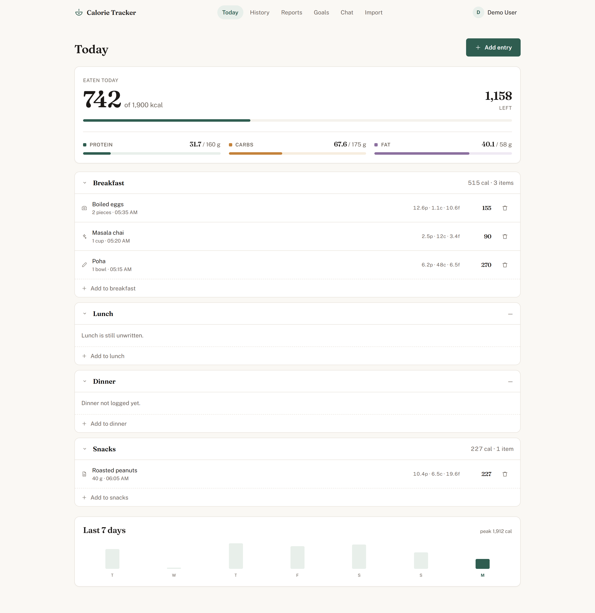
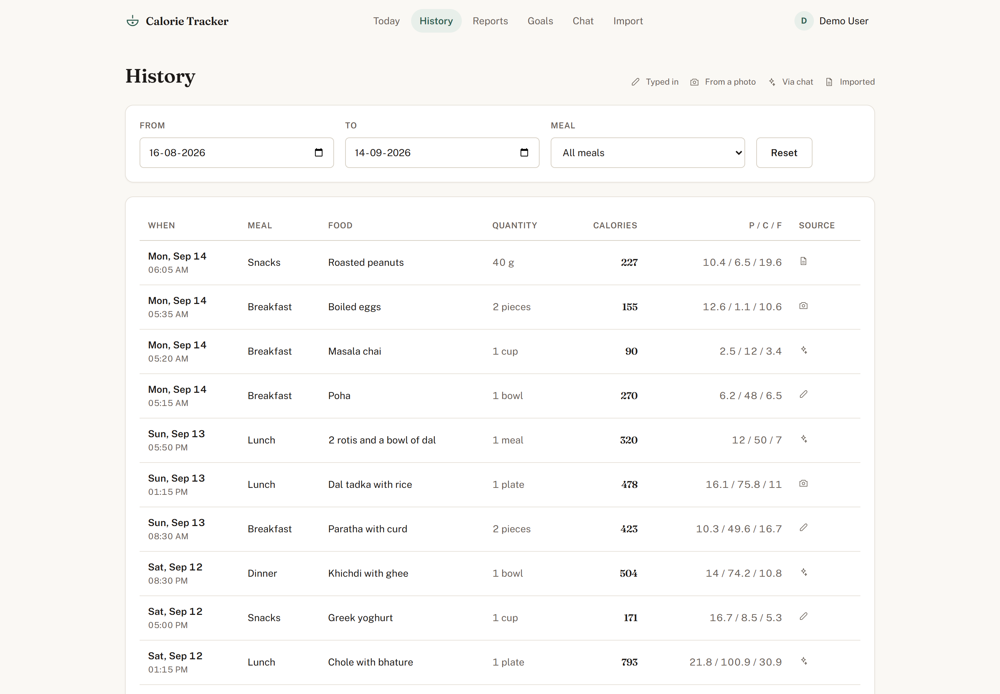
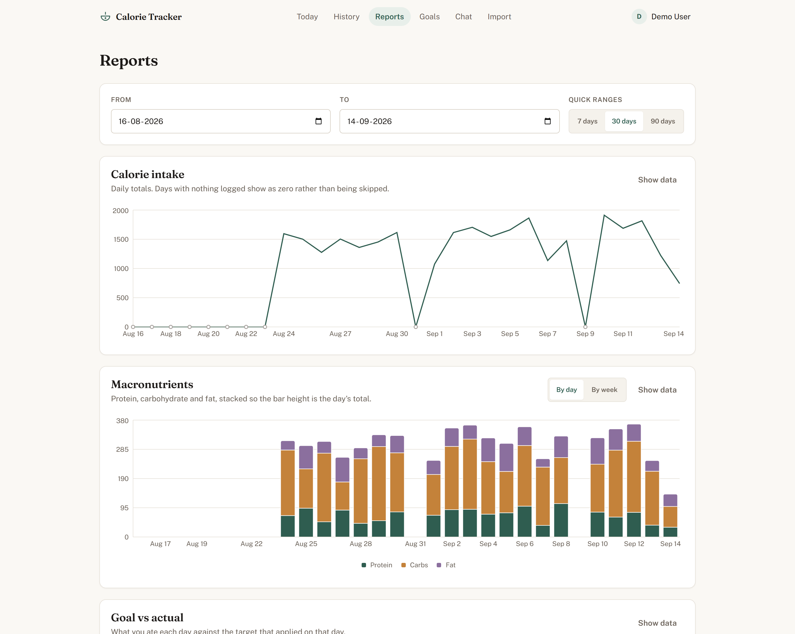
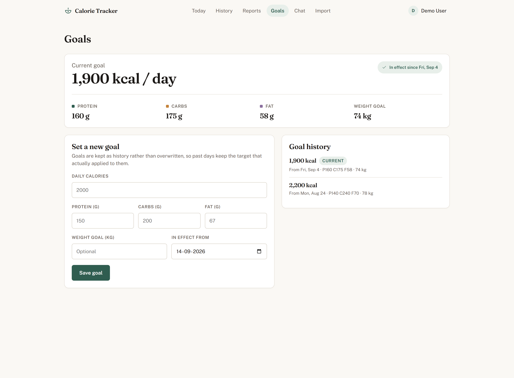
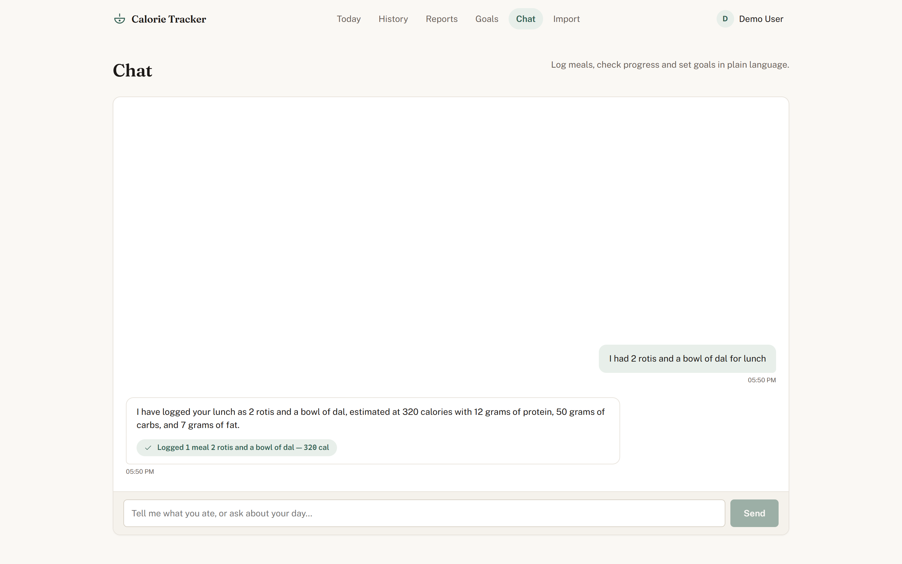
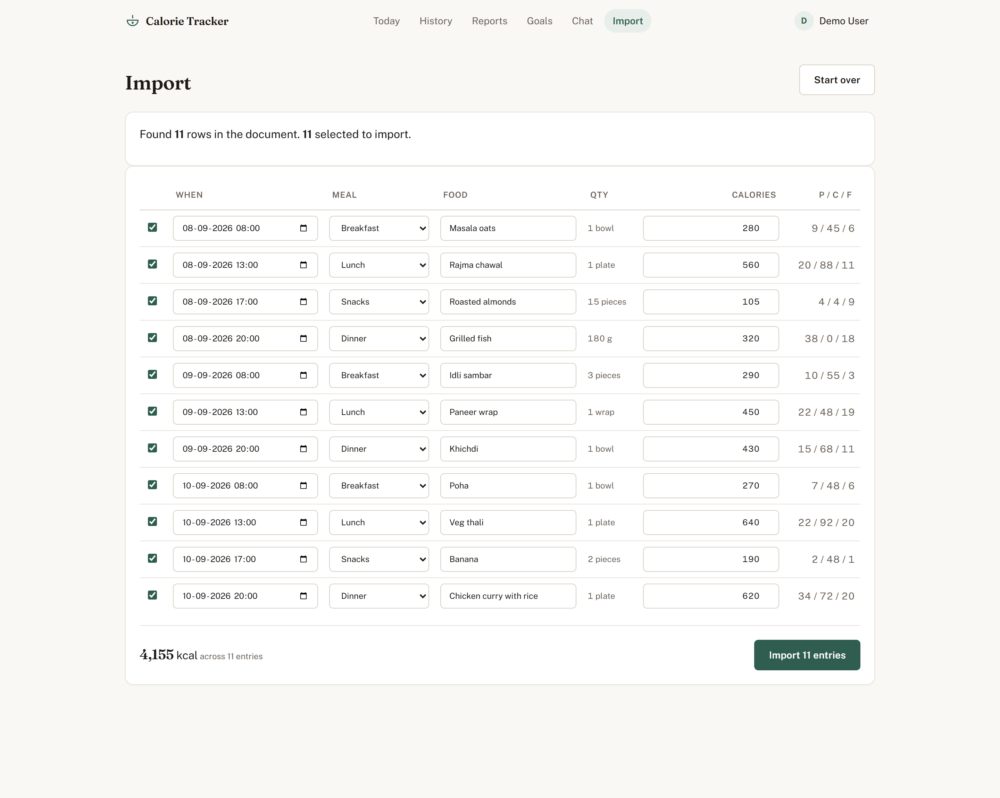
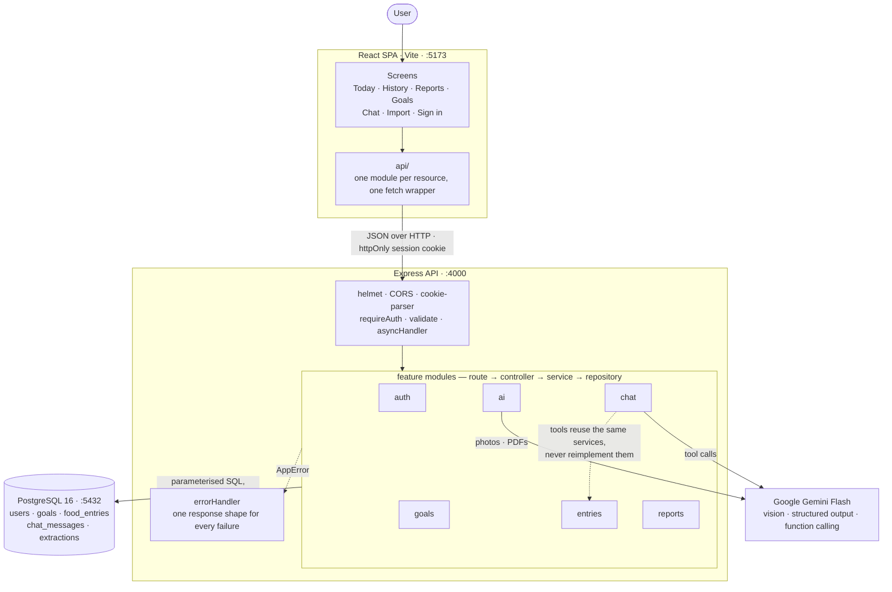
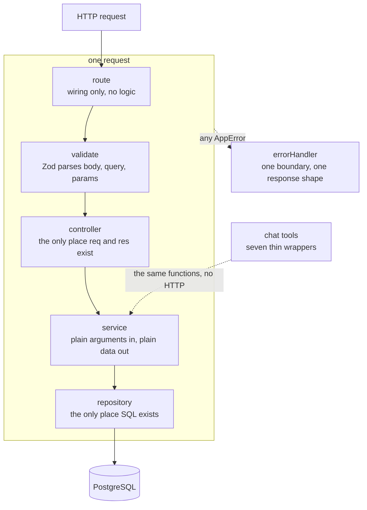
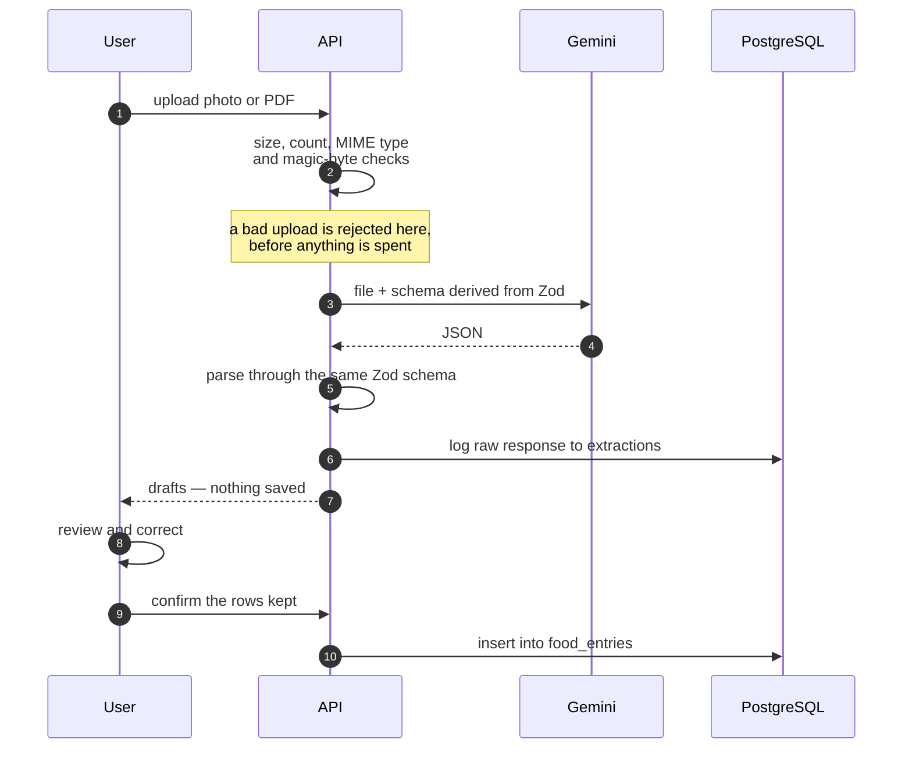

# Personal Calorie Tracker

A full-stack nutrition tracker. Log meals by meal type, set dated health goals,
review macro and micronutrient trends, pre-fill entries from a photo of a
nutrition label or a plate of food, import a diary from a PDF, and do any of it
by talking to an assistant instead of filling in forms.

| | |
|---|---|
| **Stack** | Node 20 · Express 5 · PostgreSQL 16 (raw SQL) · React 19 · Vite · Recharts · Google Gemini |
| **Run it** | `docker compose up --build` |
| **Tests** | `cd server && npm test` — 101 tests, ~4s |



---

## Contents

- [Quick start](#quick-start)
- [Requirements covered](#requirements-covered)
- [Screens](#screens)
- [Architecture](#architecture)
- [Data model](#data-model)
- [API reference](#api-reference)
- [Environment variables](#environment-variables)
- [Tests](#tests)
- [Project layout](#project-layout)
- [Design decisions](#design-decisions)
- [Assumptions](#assumptions)
- [What I would do with more time](#what-i-would-do-with-more-time)
- [Troubleshooting](#troubleshooting)

---

## Quick start

Requires Docker. Nothing else — no local Node, no local Postgres.

```bash
git clone <repo> && cd PersonalCalorieTracker

docker compose up --build                     # database, API and web
docker compose exec server npm run seed       # three weeks of demo data
```

| | |
|---|---|
| Web | <http://localhost:5173> |
| API | <http://localhost:4000/api/health> |
| Database | `localhost:5432` — user `calorie`, password `calorie` |

Then sign in:

| Email | Password |
|---|---|
| `demo@example.com` | `demo1234` |

**No `.env` file is required.** `docker-compose.yml` carries a working default
for every variable except `GEMINI_API_KEY`. Migrations run automatically on API
startup, so there is no separate migrate step.

To enable the AI features (photo extraction, chat, PDF import), copy
`.env.example` to `.env` and add a key from
[Google AI Studio](https://aistudio.google.com/apikey):

```bash
cp .env.example .env
# set GEMINI_API_KEY=...
docker compose up -d --build server
```

Without a key the app runs normally and those three endpoints return a clear
**503** naming the missing variable — never a crash, and never a 500.

### Running without Docker

Requires Node 20+ and a PostgreSQL 16 instance.

```bash
cp .env.example .env          # point DATABASE_URL at your Postgres

cd server && npm install && npm run dev     # http://localhost:4000
cd web    && npm install && npm run dev     # http://localhost:5173
```

The server reads `.env` from either `server/` or the repository root, so the
same file works for both Docker and a local run.

---

## Requirements covered

### Core

| Requirement | How it is met | Where |
|---|---|---|
| **Goal setting** — set and manage daily calorie, protein/carb/fat and weight targets through the web app | A current-goal card, a create form that shows what your macros add up to as you type, and a dated history. Goals are appended, never overwritten | `web/src/pages/GoalsPage.jsx`<br/>`server/src/modules/goals/` |
| **Meal entry** — entries grouped by meal type with food name, quantity and nutritional values (calories, macros, micros) | An add-entry modal reachable from every meal section. Four meal buckets enforced by enum *and* a CHECK constraint; micronutrients stored as open-ended JSONB | `web/src/components/EntryFormModal.jsx`<br/>`server/src/modules/entries/` |
| **Time-range listing** — list entries in a time range, filterable by date and meal type | History screen with date-range and meal filters over `GET /api/entries?from&to&mealType`, built as a dynamic but fully parameterised WHERE clause | `web/src/pages/HistoryPage.jsx`<br/>`entries.repository.js` |
| **Reports & graphs** — weekly calorie trend, macros by day/week, micronutrient summary, goal vs actual | Four endpoints that aggregate entirely in SQL, and four charts sharing one date-range control | `server/src/modules/reports/`<br/>`web/src/pages/ReportsPage.jsx` |
| **AI calorie extraction** — upload a photo of a label or a plate and pre-fill the values | `POST /api/extract/image` returns drafts that populate the entry form, every value editable before saving | `server/src/modules/ai/extraction.service.js`<br/>`EntryFormModal.jsx` |

### Data model and programming constraints

| Requirement | How it is met | Where |
|---|---|---|
| **A data model that suits the requirements** | Five tables. Macros as numeric columns because they are fixed and summed everywhere; micronutrients as JSONB because the set is open-ended; goals append-only and dated so history cannot be rewritten | `server/src/db/migrations/` |
| **APIs separate from frontend code; the frontend talks to the backend only through APIs** | Two independent packages sharing no code. Every call goes through a single fetch wrapper — no component calls `fetch` directly | `web/src/api/client.js` |
| **Persist all food entries, goals and user data in a database** | PostgreSQL 16, raw SQL through `pg`, migrations applied automatically on startup | `server/src/db/` |
| **Pagination in all list APIs** | Every list endpoint returns the identical `{ data, pagination }` envelope. A test asserts the shape is the same on entries, goals and chat history | `server/src/utils/pagination.js`<br/>`tests/integration/pagination.test.js` |

### Bonus features

| Requirement | How it is met | Where |
|---|---|---|
| **Conversational chat interface** — perform app actions in natural language | Seven tools — log a meal, read entries, set and read goals, daily progress, weekly summary, answer a question — each a thin wrapper over the service the REST controllers already call. Tool loop capped at five round-trips; conversation persisted | `server/src/modules/chat/`<br/>`web/src/pages/ChatPage.jsx` |
| **Multi-user support** — sign up, log in, keep private data | JWT in an httpOnly cookie; the user id comes from that token only, and every query is scoped by it. 29 tests cover isolation, including that another user's row returns 404 rather than 403 | `server/src/middleware/auth.js`<br/>`tests/integration/ownership.test.js` |
| **Bulk import via PDF** — upload a tabular diary and import the entries | The PDF goes to the model whole, no text-extraction step. Rows come back as an editable table; each is validated individually so one bad row never costs the rest | `server/src/modules/ai/pdf.service.js`<br/>`web/src/pages/ImportPage.jsx` |

### Code quality

| Guideline | How it is addressed |
|---|---|
| **Clean code** | A fixed layering (`route → validate → controller → service → repository`) that every feature follows identically, so any module can be read by knowing one shape. Names state intent — `findByEmailWithHash` says at the call site that it returns a password hash |
| **Modularity** | One directory per feature, each with its own routes, controller, service, repository and schema. Shared concerns live once: one pagination helper, one error class, one fetch wrapper, one dropzone, one formatting module |
| **Documentation** | This README, plus JSDoc on every API function and service. Setup is one command, and assumptions are [listed explicitly](#assumptions) |
| **Error handling** | Zod validation at every boundary; one `AppError` type and one middleware, so every failure has the same shape; AI failures distinguished into timeout, quota, unusable reply and not-configured rather than collapsing to a 500; a failing chat tool returns structured data so the assistant can explain it |
| **Comments** | Comments explain *why*, not what — why micronutrients are unnested with `jsonb_each_text`, why the user filter sits in the `ON` clause, why a model turn is echoed back verbatim. Decisions that would otherwise look arbitrary carry their reason |

---

## Screens

### Today

Calories as a large figure against the day's target, three macro bars beneath,
then four collapsible meal sections with per-meal subtotals. An empty meal keeps
a faint "+ Add" row — on day one all four are empty, and four blank panels read
as a broken screen rather than a new one.


### Add entry

One modal, two paths. Typing and photographing both produce a list of editable
items; a photo simply fills that list in advance. There is no separate "review
extraction" step because the review **is** the form — every extracted value is
editable in place, and nothing is saved until you press Save.

A label result shows an informational note; a plate result shows a warning with
the model's confidence, because one is transcription and the other is an
estimate.

### History

Date range and meal filters, a paginated table, and a small icon per row showing
how the entry was created (typed, photo, chat, or imported).



### Reports

Four charts sharing one date-range control. Each has a **"Show data"** toggle
that renders the underlying numbers as a table — reading a value should never
depend on hovering, which keyboard and touch users cannot do.



### Goals

The current goal, a form that tells you what your macros actually add up to as
you type, and the append-only history with effective dates.



### Chat

Tool results render as readable cards — `✓ Logged 1 bowl Poha — 270 cal` — never
as raw JSON. The numbers come from the same SQL the charts are drawn from.



### Import

Upload a food diary exported as a PDF. The rows are read out of the document and
land in an **editable table** — nothing is written until you confirm. Rows can be
corrected or unticked, and a row the server rejects stays in place, highlighted,
with the reason beside it, so you fix it where it already is.



---

## Architecture

The frontend is a plain Vite SPA and the backend is a separate Express service.
They share no code and communicate only over HTTP, so the separation the brief
asks for is physically enforced rather than promised.



Inside the API, requests flow through fixed layers and each layer may only talk
to the next. The dotted path is the one that matters most: the chat tools enter
at the **service** layer, running the same functions the controllers call
without going near HTTP.



Three rules hold this together, and each one buys something concrete:

**SQL exists only in repositories.** Every repository function takes `userId` as
its first argument. There is no code path that can read or write another user's
row, because there is no query that does not scope by user.

**`req` and `res` exist only in controllers and middleware.** Services take
plain arguments and return plain data. This is what lets the chat tools call the
*same* service functions the REST controllers call — see
[Design decisions](#design-decisions).

**One error type, one error boundary.** Controllers are wrapped in
`asyncHandler`; everything that fails throws an `AppError` and exactly one
middleware turns it into a response. There are no scattered `try`/`catch` blocks
in routes or controllers.

### Response conventions

Every list endpoint returns the same envelope:

```json
{
  "data": [],
  "pagination": { "page": 1, "limit": 20, "total": 0, "hasNext": false }
}
```

Every failure returns the same envelope:

```json
{
  "error": {
    "code": "VALIDATION_ERROR",
    "message": "Invalid request body",
    "details": [{ "field": "mealType", "message": "Meal type must be one of: ..." }]
  }
}
```

| Code | Status | Meaning |
|---|---|---|
| `VALIDATION_ERROR` | 400 | Input failed validation; `details` names the fields |
| `UNAUTHORIZED` | 401 | No session, or an expired/forged token |
| `NOT_FOUND` | 404 | No such resource — **or it belongs to someone else** |
| `CONFLICT` | 409 | Email already registered |
| `PAYLOAD_TOO_LARGE` | 413 | Upload above the 5 MB cap |
| `UNSUPPORTED_MEDIA_TYPE` | 415 | Wrong file type, by declared type *or* magic bytes |
| `RATE_LIMITED` | 429 | AI provider quota exhausted |
| `AI_INVALID_RESPONSE` | 502 | The model replied with something unusable |
| `AI_UNAVAILABLE` | 503 | No API key configured, or the key was rejected |
| `AI_TIMEOUT` | 504 | The model did not answer in time |

---

## Data model

Five tables. Migrations are numbered SQL files applied in order.

```
users                         goals  (APPEND ONLY)
  id            serial pk       id              serial pk
  email         text unique     user_id         → users
  password_hash text            effective_from  date
  name          text            daily_calories  int
  created_at    timestamptz     protein_g       numeric
                                carbs_g         numeric
food_entries                    fat_g           numeric
  id          serial pk         weight_goal_kg  numeric
  user_id     → users           created_at      timestamptz
  consumed_at timestamptz
  meal_type   breakfast|lunch|dinner|snacks
  food_name   text            chat_messages
  quantity    numeric           id          serial pk
  unit        text              user_id     → users
  calories    numeric           role        user|assistant
  protein_g   numeric           content     text
  carbs_g     numeric           tool_calls  jsonb
  fat_g       numeric           created_at  timestamptz
  micros      jsonb
  source      manual|photo|   extractions
              chat|import       id           serial pk
  created_at  timestamptz       user_id      → users
                                source_type  label|plate|pdf
                                raw_response jsonb
                                status       pending|success|failed
                                created_at   timestamptz
```

Indexes: `(user_id, consumed_at DESC)` and `(user_id, meal_type)` on
`food_entries`; `(user_id, effective_from DESC)` on `goals`;
`(user_id, created_at DESC)` on `chat_messages` and `extractions`.

Every foreign key is `ON DELETE CASCADE`, so removing a user removes their data
with no orphan rows. Every table carries CHECK constraints mirroring the Zod
rules — Zod produces the friendly message, the constraint is the backstop.

### Migrations

```bash
npm run migrate          # apply anything pending
npm run migrate:status   # list applied vs pending
```

Applied files are tracked in `schema_migrations` with a SHA-256 checksum. Each
migration runs in its own transaction, so a failure leaves neither half-built
schema nor a ledger entry. The runner takes a Postgres advisory lock, so two API
processes booting against one database is safe. Editing a migration after it has
run is reported as an error rather than silently diverging from the live schema —
add a new numbered file instead.

---

## API reference

All paths are prefixed `/api`. Authentication is a JWT in an `httpOnly`,
`SameSite=Lax` cookie; **the user id is read from that token only, never from the
request body**.

### Auth

| Method | Path | Auth | Body / params | Description |
|---|---|:---:|---|---|
| `POST` | `/auth/signup` | – | `email`, `password` (8–72), `name?` | Create an account, set the session cookie. `409` if the email exists |
| `POST` | `/auth/login` | – | `email`, `password` | Verify credentials. Generic `401` that does not reveal whether the email exists |
| `POST` | `/auth/logout` | – | | Clear the cookie (`204`). Works with an expired session |
| `GET` | `/auth/me` | ✓ | | The authenticated user |

### Goals

| Method | Path | Auth | Body / params | Description |
|---|---|:---:|---|---|
| `POST` | `/goals` | ✓ | `dailyCalories` (500–10000), `proteinG`, `carbsG`, `fatG`, `effectiveFrom?`, `weightGoalKg?` | Append a dated goal. Returns the goal plus a `warning` field |
| `GET` | `/goals/current` | ✓ | | The goal in effect today. `404` when none has been set |
| `GET` | `/goals` | ✓ | `page?`, `limit?` | Paginated history, newest first |

`effectiveFrom` defaults to today and may not be in the future. Macro targets
that do not reconcile with the calorie target (4/4/9 kcal per gram, ±15%) return
a `warning` string alongside the saved goal — **never an error**.

### Entries

| Method | Path | Auth | Body / params | Description |
|---|---|:---:|---|---|
| `POST` | `/entries` | ✓ | `mealType`, `foodName`, `quantity`, `calories`, `consumedAt?`, `unit?`, `proteinG?`, `carbsG?`, `fatG?`, `micros?`, `source?` | Log an entry |
| `GET` | `/entries` | ✓ | `from?`, `to?`, `mealType?`, `page?`, `limit?` | Paginated, newest first. `from`/`to` are inclusive calendar dates |
| `PATCH` | `/entries/:id` | ✓ | any subset of the create fields | Update. `404` if it is not yours |
| `DELETE` | `/entries/:id` | ✓ | | Delete (`204`). `404` if it is not yours |

`micros` is a map of name → positive number; keys are lowercased on write so the
micronutrient report can sum them reliably. `PATCH` replaces `micros` wholesale
rather than merging.

### Reports

| Method | Path | Auth | Params | Description |
|---|---|:---:|---|---|
| `GET` | `/reports/calorie-trend` | ✓ | `from?`, `to?` | Daily totals, one row per day including empty days |
| `GET` | `/reports/macros` | ✓ | `from?`, `to?`, `granularity=day\|week` | Protein / carbs / fat per bucket |
| `GET` | `/reports/micros` | ✓ | `from?`, `to?` | Micronutrient totals, largest first |
| `GET` | `/reports/goal-vs-actual` | ✓ | `from?`, `to?` | Each day's intake against the goal that applied that day |

Ranges default to the last 30 days, are inclusive at both ends, may not end in
the future, and are capped at 366 days.

### AI

| Method | Path | Auth | Body | Description |
|---|---|:---:|---|---|
| `POST` | `/extract/image` | ✓ | `image` (multipart), `?type=label\|plate` | Extract nutrition from a photo. **Returns drafts, saves nothing** |
| `POST` | `/import/pdf` | ✓ | `file` (multipart PDF) | Parse a food diary PDF. **Returns drafts, saves nothing** |
| `POST` | `/import/confirm` | ✓ | `entries[]` | Bulk-insert reviewed rows in a transaction; reports rejected rows |
| `POST` | `/chat` | ✓ | `message` | Run the tool loop and return the reply plus what the tools did |
| `GET` | `/chat/history` | ✓ | `page?`, `limit?` | Paginated conversation, newest first |

### Health

| Method | Path | Auth | Description |
|---|---|:---:|---|
| `GET` | `/health` | – | `{ status, db }`. `503` when the database is unreachable |

### Example

```bash
# Sign in and keep the cookie
curl -c jar.txt -H 'Content-Type: application/json' \
  -d '{"email":"demo@example.com","password":"demo1234"}' \
  http://localhost:4000/api/auth/login

# Last week's calories, one row per day
curl -b jar.txt 'http://localhost:4000/api/reports/calorie-trend?from=2026-09-07&to=2026-09-13'

# Log a meal
curl -b jar.txt -H 'Content-Type: application/json' \
  -d '{"mealType":"lunch","foodName":"Dal tadka","quantity":1,"unit":"plate","calories":520,"proteinG":18,"carbsG":82,"fatG":12}' \
  http://localhost:4000/api/entries
```

---

## Environment variables

Every variable has a working default in `docker-compose.yml` except
`GEMINI_API_KEY`. Docker Compose automatically reads a `.env` file in the project
root, so values set there reach both containers.

| Variable | Default | Description |
|---|---|---|
| `POSTGRES_USER` | `calorie` | Postgres role. Changing it after first boot needs `docker compose down -v` |
| `POSTGRES_PASSWORD` | `calorie` | Postgres password |
| `POSTGRES_DB` | `calorie_tracker` | Database name |
| `DATABASE_URL` | *(built from the three above)* | Full connection string used by the API |
| `PG_POOL_MAX` | `10` | Maximum pooled connections |
| `NODE_ENV` | `development` | Controls error verbosity and the `secure` cookie flag |
| `PORT` | `4000` | Port the API listens on |
| `JSON_BODY_LIMIT` | `1mb` | Maximum JSON body. Uploads are capped separately |
| `JWT_SECRET` | *(insecure dev value)* | **Must be replaced in production.** Minimum 32 characters |
| `JWT_EXPIRES_IN` | `7d` | Session lifetime |
| `COOKIE_NAME` | `ct_token` | Name of the session cookie |
| `CORS_ORIGIN` | `http://localhost:5173` | Comma-separated allow-list. `*` is invalid with credentials |
| `GEMINI_API_KEY` | *(empty)* | Required for photo extraction, chat and PDF import |
| `GEMINI_MODEL` | `gemini-3.8-flash` | Any current Flash-tier model |
| `UPLOAD_MAX_BYTES` | `5242880` | Upload ceiling (5 MB) |
| `VITE_API_URL` | `http://localhost:4000/api` | API base URL, baked into the frontend build |

The API validates its configuration with Zod at startup and **refuses to boot**
on an invalid value. A server that starts with a missing JWT secret and fails on
the first login is far worse to debug than one that never starts.

> **Free-tier Gemini keys allow 20 requests per day, per model.** If you hit
> `429 RATE_LIMITED` while trying the demo, either wait for the reset or point
> `GEMINI_MODEL` at a different model — each has its own allowance.

---

## Tests

```bash
cd server
npm test          # 101 tests, ~4s
npm run test:watch
```

Vitest, run against a **real PostgreSQL database rather than mocks**. Most of
what is worth testing here *is* the SQL — a gap-filled date series, a LATERAL
join resolving a different goal per day, JSONB aggregation across ragged keys.
Mocking the database would test the mock and leave every one of those untested.

The suite creates and migrates `calorie_tracker_test` itself on first run, so
`npm test` works on a clean machine with the stack up. It is a separate
database: running the tests can never wipe the data you were looking at in the
app.

Coverage is aimed at the parts that are actually hard, not at a percentage:

| Area | What is asserted |
|---|---|
| **Cross-user access** | Another user's entry returns **404, not 403**, and the response is byte-identical to one for an id that does not exist. A `userId` planted in the request body is ignored. All 15 protected routes `401` without a session |
| **Report SQL** | A day with no entries returns a **zero row** rather than vanishing; goal-vs-actual picks the goal that applied on each day across a mid-range change; same-date goals tie-break to the later one; days before the first goal are `null`, never `0` |
| **JSONB aggregation** | Micronutrients summed across entries with different key sets, with per-key entry counts |
| **Pagination** | `total` counts all matches rather than the page and respects the same filters as the rows; `hasNext` is correct on a full final page, a partial one and past the end; no row is repeated or dropped across pages |
| **Week bucketing** | A weekly bucket extending before the range start still excludes data outside the range |
| **AI output validation** | Zod rejects negative calories, an empty item list, a confidence above 1, prose where a number belongs, and a reply that is not an object |
| **Macro reconciliation** | Warns outside ±15%, stays quiet inside it, exact on both edges |

---

## Project layout

```
.
├── docker-compose.yml
├── .env.example                  every variable, documented inline
├── docs/screenshots/
├── server/
│   ├── src/
│   │   ├── config/               env parsing (Zod), shared constants
│   │   ├── db/
│   │   │   ├── pool.js           pg pool, type parsers, transactions
│   │   │   ├── migrate.js        idempotent, checksummed migration runner
│   │   │   ├── migrations/       001…005, numbered SQL
│   │   │   ├── seed.js           deterministic demo data
│   │   │   └── seed.data.js      the food catalogue
│   │   ├── middleware/           auth, validate, asyncHandler, errorHandler, upload
│   │   ├── modules/
│   │   │   ├── auth/             routes · controller · service · repository · schema
│   │   │   ├── goals/            ″
│   │   │   ├── entries/          ″
│   │   │   ├── reports/          ″  (the report SQL lives here)
│   │   │   ├── ai/               gemini.client · extraction.service · pdf.service
│   │   │   │                     · drafts · jsonSchema · prompts · schemas
│   │   │   └── chat/             chat.tools — seven thin wrappers over services
│   │   ├── utils/                AppError, pagination, dates, logger, jwt
│   │   ├── app.js                middleware wiring
│   │   └── server.js             listen + graceful shutdown
│   └── tests/
│       ├── unit/                 pure logic, no database
│       └── integration/          real database, real HTTP
└── web/
    └── src/
        ├── api/                  one module per backend resource, JSDoc'd
        ├── components/           shared UI — entry modal, chart frame, dropzone
        ├── hooks/                useAuth, useAsync
        ├── lib/format.js         all display formatting
        ├── pages/                one per screen
        └── App.jsx               routes
```

---

## Design decisions

### Goals are append-only and dated

A goal is never updated or deleted. Changing a target inserts a new row with a
later `effective_from`, and the goal that applies to any day is the most recent
row dated on or before it.

**What breaks without this:** goal-vs-actual reports history. If goals were a
single mutable row, raising your calorie target on Wednesday would retroactively
rewrite Monday's chart — Monday would be measured against a target that did not
exist yet, and a day you missed would silently become a day you hit. The history
would change every time you changed your mind.

The cost is that "the current goal" is a query rather than a lookup, and that
resolving it per-day in a report needs a LATERAL join. That is a real cost, paid
once in `reports.repository.js`, in exchange for a report that cannot lie.

Two rows may share an `effective_from` — you changed your mind twice in a day —
so every read orders by `(effective_from DESC, id DESC)` and the later insert
wins deterministically.

### JSONB for micronutrients, columns for macros

Macros are a fixed set of three and are summed in every single report, so they
are real `numeric` columns: indexable, constrained, and summed by the database
without ceremony.

Micronutrients are open-ended — one label lists iron and B12, the next lists
sodium and vitamin D, a third lists nothing. A column per micronutrient would
mean a migration every time a new label appeared, and a table that is mostly
`NULL`. They live in a single JSONB column with a CHECK that it is an object.

The cost is that aggregating them needs `jsonb_each_text` to unnest the object
into rows before `GROUP BY` can touch it, and that there is no per-nutrient
index. For a summary over one user's date range that is entirely acceptable.

Because the report sums by exact key, **keys are normalised to lowercase on
write** — otherwise `Iron_mg` and `iron_mg` silently become two separate rows in
every report.

### `generate_series` gap-filling

Every time-series report builds its date series with `generate_series` and LEFT
JOINs the data onto it, rather than grouping the rows that exist.

Without it, a day with no entries simply does not appear in the result. A chart
drawn from that result connects Monday straight to Wednesday — it does not show
a gap, it shows a **line**, and it quietly asserts an intake that never happened.
The seed deliberately leaves two days empty so this is visible rather than
theoretical, and a test asserts the zero row directly.

One detail worth flagging: the user filter sits in the `ON` clause, not `WHERE`.
Moving it to `WHERE` discards the generated rows that have no match and undoes
the gap filling entirely — the classic way this query goes wrong.

### `LIMIT`/`OFFSET` pagination, not keyset

Every list endpoint pages with `LIMIT`/`OFFSET` and returns `total` from a
`COUNT(*)` over the same filters.

**The tradeoff, named:** `OFFSET n` makes the database walk and discard `n` rows,
so page 5,000 costs materially more than page 1. The separate `COUNT(*)` is a
second pass over the filtered set. At scale both are real problems.

**Why it is still right here:** this is a personal food diary. A heavy user logs
perhaps 2,000 rows a year, and the UI needs a page count and a jump-to-page
control, which keyset pagination cannot provide without an additional count
anyway. `OFFSET` keeps the API honest and simple at the size the data actually
is.

**What the answer would be at scale:** keyset (cursor) pagination — `WHERE
(consumed_at, id) < ($1, $2) ORDER BY consumed_at DESC, id DESC LIMIT $3`, using
the index that already exists — with `total` dropped or replaced by an estimate.
The envelope would gain a `nextCursor` and lose `page`. The change is contained
to `utils/pagination.js` and the repositories.

`total` comes from a separate `COUNT(*)` rather than a `COUNT(*) OVER()` window
for a specific reason: the window returns **no row at all** when the requested
page is past the end, which would report `total: 0` for a user who does have
data.

### AI output is reviewed before it is committed

No AI feature writes to `food_entries`. Photo extraction and PDF import return
**drafts**; the user reviews them and confirms through the normal entries path.



A model that is confident and wrong is the normal failure mode, not an edge
case — it will read `1.5g` as `15g` and say so with complete assurance.
Nutrition data the user never looked at should not end up in their history.

Layered on top of that:

- The response schema sent to Gemini is **derived from the Zod schema**, so the
  two cannot drift apart, and the reply is parsed through that same Zod schema
  anyway. A response schema constrains structure, not sanity — the model can
  return `-40` calories inside a perfectly valid shape.
- `isEstimate` is **not taken on trust** for plate photos. A hallucinated `false`
  would suppress the UI's warning on exactly the input that most needs it, so a
  plate result is always an estimate regardless of what the model claims.
- Uploads are checked for size, count, MIME type **and magic bytes** before any
  model call — a bad upload costs nothing. The declared `Content-Type` is never
  trusted, since it is forwarded to the provider.
- Every attempt is logged to `extractions` with the raw response, success or
  failure. When a user reports "it read the calories wrong", that row is the only
  record of what was actually said.
- Failures are distinguished rather than collapsed: timeout → `504`, quota →
  `429`, unusable reply → `502`, no key → `503`. "Something went wrong" gives the
  user nothing to act on when the real answer is usually "wait a minute and
  retry".

### Chat tools wrap services; they do not reimplement them

All seven tools are thin wrappers over service functions the REST controllers
already call:

| Tool | Calls |
|---|---|
| `log_meal` | `entriesService.create` |
| `get_entries` | `entriesService.list` |
| `set_goal` / `get_goals` | `goalsService.create` / `.list` |
| `daily_progress` | `reportsService.getGoalVsActual` over a single day |
| `weekly_summary` | all four report services |
| `answer_nutrition_question` | goal + trend, for personalised context |

There is **no business logic in `chat.tools.js`**, and the argument schemas are
the same Zod schemas the HTTP endpoints use. A rule added to an endpoint —
macros cannot be negative, food cannot be logged in the future — applies to
natural language the same day, for free. Verified in the test suite: `log_meal`
rejects `mealType: "brunch"` with exactly the message the REST endpoint gives.

This is the payoff for keeping `req` and `res` out of services from the very
first module. Had services taken `req`, every tool would have needed a fake one
or a duplicate implementation, and the two paths would have drifted the first
time a validation rule changed.

Two further details:

- **`userId` is not a tool parameter.** It comes from the JWT and is passed to
  every tool by the service, so there is no argument the model could produce that
  reaches another user's data.
- **A failing tool returns structured data, never throws.** The model reads the
  error and explains it: asking to "set my goal to 100 calories" produces *"Your
  daily calorie goal needs to be at least 500 calories. Would you like to set it
  to 500?"* rather than a 500 response. A thrown error would kill the whole turn,
  and "the app crashed" is a worse answer than the real reason.

The loop is capped at five tool round-trips. Without a cap, a model that keeps
calling tools — because one keeps failing, or because it is oscillating between
two — runs until the request times out, spending tokens the whole way.

### Partial failure is a first-class outcome for bulk import

`POST /import/confirm` validates **each row individually** and imports the ones
that pass, returning the failures with their index and reason.

Route-level validation is all-or-nothing: one bad row out of forty would `400`
the entire request, and the user would have to re-review all forty to fix one.
So the route validates only the envelope, and the service partitions the rows.
The accepted rows share a single transaction, so a database failure cannot leave
a half-imported diary.

A mixed result is a success (`201`), not a failure. Nothing importable at all is
a `200` with `imported: 0` — still not an error, because the request was well
formed.

### The interface never scolds

Two product decisions are enforced in the stylesheet rather than left to
judgement per screen.

**No red.** Going over a target is information, not an error. Over-target days,
over-target macro bars and the goal-vs-actual chart all render in ochre
(`--carbs`), the same colour the app already uses for carbohydrate — noticeable,
never alarming. Red is reserved for nothing at all: a failed request reports in
the same ochre. A calorie tracker that flashes red at a large dinner teaches
people to stop opening it.

**No streaks, no badges, no gamification.** There is no logging streak, no
"perfect week", no congratulation. The reward for logging is an accurate
history, and a streak counter mostly punishes the day you forget. The Today
screen leads with what is *left*, which is the number that changes a decision;
everything else is a record.

The palette makes this cheap to hold: one accent (`--accent`, a deep green), one
caution (`--carbs`, ochre), and macro colours that carry meaning consistently —
protein green, carbohydrate ochre, fat violet — in the charts, the progress bars
and the goal card alike.

### Calendar dates are strings, end to end

`node-postgres` turns a `date` column into a JavaScript `Date` at **local**
midnight, so `2026-09-13` serialises to `"2026-09-12T18:30:00.000Z"` in UTC+5:30
— a day earlier than the user chose. Every goal would display one day early and
the goal-vs-actual join would attach the wrong day's target.

A type parser keeps `date` columns as `"YYYY-MM-DD"` strings throughout, and
`utils/dates.js` builds dates from local getters rather than
`toISOString().slice(0, 10)`, which has exactly the same bug on the JavaScript
side. `timestamptz` columns such as `consumed_at` are genuine instants and keep
normal `Date` handling.

### Numbers are numbers

`node-postgres` returns `NUMERIC` and `BIGINT` as strings, because both can
exceed JavaScript's safe integer range. Every numeric in this schema is a
nutrition value or a `COUNT`, all far inside that range, so type parsers convert
them at the driver. Without this, `calories` arrives as `"520.00"` and every
`total` as `"25"` — and `"520.00" + "300.00"` is a string concatenation that
silently produces nonsense.

---

## Assumptions

1. **One timezone.** The server stores instants and aggregates reports by its own
   day boundaries (UTC in Docker), and the UI renders every date and time in that
   same zone. Mixing them would put an entry on a different day in History than
   the one the Reports charts count it in. Per-user timezones are the correct
   fix and are listed below.
2. **Nutrition values are user-supplied.** There is no food database and no
   barcode lookup. Values are typed, estimated by the model, or read from a
   label. The app is a ledger, not a nutrition authority.
3. **Micronutrient units are carried in the key** (`iron_mg`, `vitamin_d_ug`)
   rather than modelled separately. This keeps the JSONB flat and makes the
   report groupable, at the cost of no unit conversion.
4. **No recommended daily allowances.** Micronutrients are reported as totals,
   not as a percentage of a target, because RDAs vary by age, sex and region and
   the brief does not ask for them.
5. **A goal applies from its date forward, indefinitely**, until a later goal
   supersedes it. There is no end date.
6. **The demo account is disposable.** `npm run seed` replaces it and its data on
   every run, and touches no other account.
7. **`meal_type` is a fixed set of four.** The brief names them, and a CHECK
   constraint enforces them; supporting custom meals would mean a lookup table.
8. **Sessions are stateless.** A JWT is valid until it expires; there is no
   server-side revocation list, so signing out clears the cookie but does not
   invalidate a token already copied elsewhere.

---

## What I would do with more time

**Per-user timezones.** The single biggest correctness gap. Store an IANA zone on
the user, aggregate with `AT TIME ZONE` in the report queries, and render in the
user's zone. Everything else in the app is already built around a single,
explicitly stated display timezone, so the change is contained.

**Keyset pagination** for entries and chat history, as described above, once a
user's history is large enough for `OFFSET` to matter.

**Token-based session revocation.** A short-lived access token plus a refresh
token in a revocable store, so signing out everywhere actually works.

**Rate limiting** on `/auth/login` and the AI endpoints. The login endpoint is
currently protected only by bcrypt's cost; a per-IP limiter belongs there before
this is exposed publicly.

**Editing entries from History.** The table is read-only apart from deletion;
the entry modal already supports everything needed and just needs wiring to a
row click.

**Streaming chat responses.** The tool loop can take ten seconds or more, and a
streamed reply would make it feel far faster than a spinner does.

**A food database.** Even a small local one would remove most of the typing and
make estimates consistent between entries.

**End-to-end tests in CI.** The browser-driven checks used during development
(Puppeteer against the real app) should be committed and run in CI alongside the
Vitest suite, with the AI calls stubbed.

**Optimistic updates** on the Today screen. Adding an entry currently waits for
the round trip before the list refreshes.

---

## Troubleshooting

**`docker compose up` fails to install dependencies.** The build needs network
access to the npm registry. Both Dockerfiles assert that every dependency
resolved after `npm ci`, so a partial install fails the build loudly rather than
producing an image that crashes at runtime.

**AI endpoints return 503.** No `GEMINI_API_KEY` is configured, or the key was
rejected. The message says which.

**AI endpoints return 429.** Free-tier Gemini keys allow 20 requests per day per
model. Wait for the reset or change `GEMINI_MODEL`.

**Code changes are not picked up (Windows hosts).** File-change events do not
cross a Docker bind mount from a Windows filesystem, so neither Node's `--watch`
nor Vite's watcher notices edits made on the host. Restart the affected
container:

```bash
docker compose restart server   # backend changes
docker compose restart web      # frontend changes
```

Use `--build` only when dependencies change. Hot reload works normally on macOS
and Linux.

**Starting over.**

```bash
docker compose down -v          # removes the database volume too
docker compose up --build
docker compose exec server npm run seed
```
